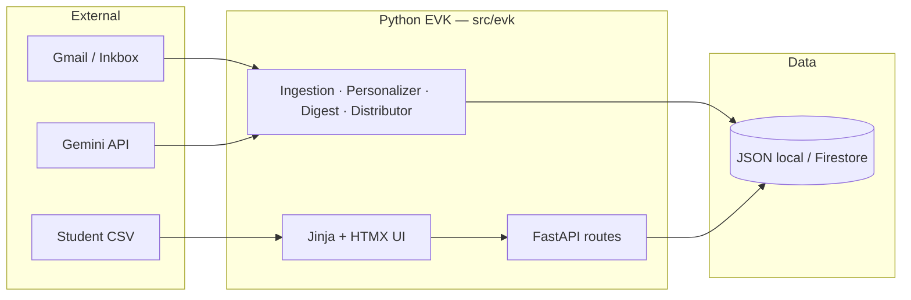

# EVKids — Technical Architecture

**One sentence:** A Python orchestrator that ingests student opportunities from Gmail, classifies them with Gemini, matches them to a charity roster, and emails personalized digests under human admin review — with a student self-service portal.

**Canonical code:** `src/evk/` (FastAPI · Jinja2 · HTMX · Gemini · Gmail/Inkbox · JSON/Firestore).

**Legacy / not in production path:** Root-level Next.js artifacts (`app/`, `lib/`, `dashboard/`) — reference only.

---

## 1. Objectives

| Objective | How the system delivers it |
|-----------|----------------------------|
| **Surface real opportunities** | Poll shared Gmail; Gemini extracts structured opp records |
| **Reduce noise** | Classifier threshold, dedup, admin approve/reject |
| **Match students to opps** | Rule-based + Gemini scoring over roster × approved catalogue |
| **Notify students safely** | Weekly/biweekly digests; urgent path on high-priority approve |
| **Student self-service** | Login (OTP), dashboard, profile, suggestions, outcome tracking |
| **Preserve roster truth** | CSV import → `students`, outcomes, activation emails |
| **Auditability** | Structured logging; draft lifecycle states |

---

## 2. Actors

| Actor | Role | Access |
|-------|------|--------|
| **Platform admin** | Review queue, approve/send drafts, import roster, KPI, agents | Email + access key + OTP → session cookie |
| **NGO admin** | Opportunities, roster view, KPI (no draft send / user mgmt) | Same auth flow, role-gated routes |
| **Student** | Dashboard, profile, suggestions, outcome updates | Public signup (student-only) or admin activation |
| **Cron / CLI** | Poll inbox, reminders | `AUTO_POLL`, `evk` CLI |
| **REST integrators** | Headless draft/opportunity ops | `POST /admin/*` JSON API + optional bearer token |

---

## 3. System context



---

## 4. Runtime topology

| Layer | Technology | Responsibility |
|-------|------------|----------------|
| **UI** | Jinja2 + HTwind (built CSS in prod) + HTMX | Role-aware dashboards, review queue, student portal |
| **API** | FastAPI + Uvicorn | HTML routes (`evk.ui.routes.*`) + REST (`evk.api`) |
| **Agents** | Python modules in `evk.agents.*` | Ingest, classify, match, digest, distribute, scrape |
| **Data** | `local_store` (dev) / Firestore (prod) | Students, opps, drafts, sessions, users |
| **AI** | Gemini (or stub) | Classification, personalization copy |
| **Mail** | Gmail API / Inkbox stub | Inbound poll + outbound send |
| **CI** | GitHub Actions + pytest | 253+ tests including UAT, stress, CSRF |

---

## 5. UI route modules

| Module | Path prefix | Purpose |
|--------|-------------|---------|
| `evk.ui.routes.auth` | `/`, `/login`, `/auth/*`, `/profile/setup` | Landing, signup, OTP, password reset |
| `evk.ui.routes.student` | `/app/student`, `/profile`, `/opportunities/suggest` | Student dashboard & profile |
| `evk.ui.routes.admin` | `/app/admin`, `/drafts`, `/opportunities`, `/ui/*` | Admin/NGO dashboards, HTMX fragments |

Shared: `evk.ui.deps` (FastAPI dependencies), `evk.ui.view_models` (render helpers), `evk.ui.csrf` (double-submit protection).

---

## 6. Security

| Control | Implementation |
|---------|----------------|
| **Session auth** | HttpOnly cookie; `secure` in prod |
| **CSRF** | `evk_csrf` cookie + hidden form field + `X-CSRF-Token` for HTMX |
| **Signup** | Public registration limited to `student` role |
| **OTP resend** | Rate-limited per email (5 / 5 min) |
| **REST admin** | Optional `ADMIN_API_TOKEN` bearer; exempt from CSRF |
| **Webhooks** | HMAC signature verification |

---

## 7. Static assets

| Asset | Dev | Production |
|-------|-----|------------|
| Tailwind CSS | CDN fallback if `app.css` missing | Pinned build at `/static/css/app.css` |
| Build | `npm run build:css` | Commit `src/evk/ui/static/css/app.css` or build in CI |

---

## 8. Configuration

Centralized in `evk.config.Settings` / `.env`:

| Variable | Effect |
|----------|--------|
| `EVK_MODE` | `local` (stubs) vs `production` |
| `APP_ENV` | `dev` / `prod` — controls secure cookies + Tailwind mode |
| `AUTO_POLL` | Background Gmail poll thread |
| `ADMIN_API_TOKEN` | Bearer guard for `/admin` JSON API |
| `AUTH_*` | OTP TTL, demo password, email delivery mode |

---

## 9. Operations

```bash
uv run evk serve          # http://localhost:8080
uv run pytest -q          # full suite
npm run build:css         # rebuild Tailwind after template changes
```

---

## 10. Related docs

| Doc | Audience |
|-----|----------|
| `docs/roadmap.md` | Gaps, priorities, integration checklist |
| `README.md` | Operator setup |
