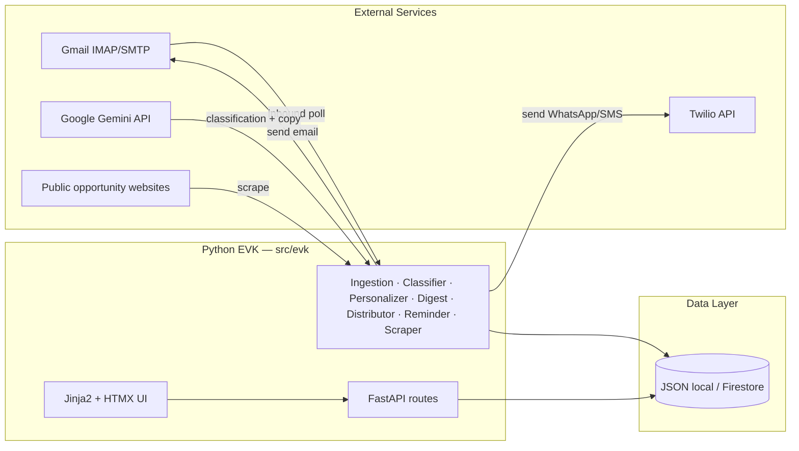

# EVKids — Technical Architecture

**One sentence:** A Python orchestrator that ingests student opportunities from Gmail and web scraping, classifies them with Gemini, score-matches them to a charity roster, and delivers personalized digests via email/WhatsApp/SMS under human admin review — with a student self-service portal and live outcome tracking.

**Canonical code:** `src/evk/` (FastAPI · Jinja2 · HTMX · Gemini · Gmail/Inkbox · Twilio · JSON/Firestore).

**Legacy / not in production path:** Root-level Next.js artifacts (`app/`, `lib/`, `dashboard/`) — reference only.

---

## 1. Objectives

| Objective | How the system delivers it |
|-----------|----------------------------|
| **Surface real opportunities** | Poll shared Gmail inbox + scrape public websites; Gemini extracts structured opportunity records |
| **Reduce noise** | Classifier confidence threshold (0.75), dedup (fuzzy title + deadline window), admin approve/reject review queue |
| **Match students to opps** | Rule-based scoring (field overlap, level, location, interests) + Gemini personalization; threshold 0.45 for drafts, 0.35 for recommendations |
| **Notify students safely** | Weekly/biweekly/monthly digests; urgent path on high-priority approve; deadline reminders at 7d and 2d |
| **Multi-channel delivery** | Email (Gmail SMTP / Inkbox API), WhatsApp (Twilio), SMS (Twilio) — student-configurable |
| **Student self-service** | Login (password + OTP), dashboard, profile preferences, opportunity suggestions, outcome tracking |
| **Manual + bulk roster** | CSV import or single-student manual add, with auto-created inactive AppUser accounts |
| **Live outcome tracking** | Students self-report (interested → applied → interview → won/rejected/passed); admin KPI dashboard reflects live state counts |
| **Auditability** | Structured logging (structlog); draft lifecycle states; RawEmail preservation |

---

## 2. Actors

| Actor | Role | Access |
|-------|------|--------|
| **Platform Admin** | Full access: review queue, approve/send drafts, user management, import roster, KPI dashboard, agent triggers, notification testing | Email + access key + OTP → session cookie |
| **NGO Admin** | Review queue, draft approve/reject/edit, opportunities, student roster, KPI dashboard, notification testing (no user deactivation) | Same auth flow, role-gated routes |
| **Student** | Dashboard, profile preferences, opportunity suggestions, outcome updates | Public signup (student-only) or admin activation |
| **Cron / CLI** | Poll inbox, run reminders, run digests, seed data | `AUTO_POLL`, `evk` CLI commands |
| **REST integrators** | Headless draft/opportunity operations | `POST /admin/*` JSON API + optional bearer token |

---

## 3. System Context



---

## 4. Tech Stack

| Component | Technology | Version / Notes |
|-----------|------------|-----------------|
| **Language** | Python 3.12+ | Type-annotated throughout |
| **Web framework** | FastAPI + Uvicorn | Async-capable, sync route handlers |
| **Templating** | Jinja2 | Server-rendered HTML with custom filters (`role_label`, `level_label`, `humandate`) |
| **Frontend interactivity** | HTMX | Partial page updates, OOB swaps, `hx-target` / `hx-swap` |
| **CSS** | Tailwind CSS | Built via `npm run build:css`; CDN fallback in dev |
| **Domain models** | Pydantic v2 | `BaseModel` with `ConfigDict`, `StrEnum` for enumerations |
| **Configuration** | pydantic-settings | `.env` file → `Settings` singleton with computed fields |
| **Database (prod)** | Google Cloud Firestore | Typed repositories via `firestore_repo.py` |
| **Database (dev)** | JSON file store | `local_store.py` — file-backed, zero-credential dev mode |
| **LLM** | Google Gemini 2.5 Flash | Via `google-genai` SDK; Vertex AI (prod) or Developer API (local with key) |
| **LLM stub** | `StubGemini` | Pattern-matching stub for offline dev — zero API cost |
| **Email inbound** | Gmail IMAP (App Password) | Or Inkbox webhook for production inbound |
| **Email outbound** | Gmail SMTP / Inkbox API | Rate-limited: ≤45 recipients/batch, 0.2s inter-send delay, 2000/day quota |
| **WhatsApp** | Twilio WhatsApp API | Optional; sandbox or business number |
| **SMS** | Twilio SMS API | Optional; E.164 phone numbers |
| **Auth** | PBKDF2-HMAC-SHA256 (200k rounds) | Password hashing + OTP codes, session cookies |
| **CSRF** | Double-submit cookie | `evk_csrf` cookie + hidden form field + `X-CSRF-Token` header for HTMX |
| **Logging** | structlog | Structured JSON logging with bind context |
| **Retry** | tenacity | Exponential backoff on Gemini transient failures (3 attempts) |
| **HTTP client** | httpx | Web scraping agent |
| **Privacy** | Pseudonymisation module | Student IDs hashed before sending to Gemini |
| **Testing** | pytest | 253+ tests including UAT, stress, CSRF |
| **Package manager** | uv | `uv run evk serve`, `uv run pytest` |
| **CI** | GitHub Actions | pytest suite |

---

## 5. Module Map

### Core modules (`src/evk/`)

| Module | Purpose |
|--------|---------|
| `models.py` | All Pydantic v2 domain models: Student, Opportunity, DraftMessage, AppUser, Session, etc. |
| `config.py` | `Settings` (pydantic-settings) — loads `.env`, exposes computed SMTP/Firestore config |
| `factory.py` | Mode-aware singletons: `get_repos()`, `get_inkbox()`, `get_gemini()` — local stubs vs production |
| `firestore_repo.py` | Typed `Repos` dataclass with per-collection CRUD repositories |
| `local_store.py` | JSON file-backed implementation of `Repos` for zero-credential dev |
| `gemini_client.py` | Unified Gemini wrapper — auto-routes to Developer API or Vertex AI |
| `inkbox_client.py` | Inkbox email API client (send, receive, webhook verification) |
| `gmail_client.py` | Gmail IMAP poll + SMTP send via App Password |
| `twilio_client.py` | Twilio WhatsApp + SMS client (lazy SDK import) |
| `auth.py` | PBKDF2 password hashing, OTP generation, session management, signup |
| `dedup.py` | Fuzzy opportunity deduplication (title similarity + deadline window) |
| `privacy.py` | Student ID pseudonymisation for Gemini calls |
| `ratelimit.py` | Daily send quota + batching + inter-send delay |
| `email_sanitizer.py` | Strip footers and signatures from inbound email |
| `stubs.py` | `StubInkbox` + `StubGemini` for local development |
| `seed.py` | Demo data seeder for development |
| `cli.py` | `evk` CLI: `serve`, `seed`, `poll`, `digest`, `remind`, `scrape` |
| `api.py` | REST API routes (headless draft/opportunity operations) |

### Agents (`src/evk/agents/`)

| Agent | Trigger | Input → Output | LLM? |
|-------|---------|-----------------|------|
| `IngestionAgent` | Gmail poll / webhook / CLI | InboundMessage → RawEmail + Opportunities + DraftMessages | No (orchestrator) |
| `ClassifierAgent` | Called by IngestionAgent | RawEmail body → `ClassifierResult` (is_opportunity, confidence, extracted opps) | **Yes** — Gemini structured output |
| `PersonalizerAgent` | Called by IngestionAgent | Opportunity × Student roster → scored Matches → DraftMessages | **Yes** — Gemini generates personalized email copy |
| `DigestAgent` | Cron / CLI / admin trigger | All opted-in students × recent opps → weekly digest DraftMessages | No — Jinja2 template assembly |
| `DistributorAgent` | Admin approve or bulk send | Approved DraftMessages → sent via Inkbox/Gmail | No |
| `ReminderAgent` | Cron / CLI | Upcoming deadlines × matched students → reminder emails | No |
| `ScraperAgent` | CLI / admin trigger | Public URLs → synthetic InboundMessages → IngestionAgent | No (but triggers classifier) |

### UI layer (`src/evk/ui/`)

| Module | Purpose |
|--------|---------|
| `routes/auth.py` | Landing, signup, login, OTP verify, password reset, profile setup |
| `routes/admin.py` | Admin/NGO dashboards, review queue, HTMX fragments, KPI, student management, notification testing |
| `routes/student.py` | Student dashboard, profile, opportunity detail, outcome save, opportunity suggest |
| `deps.py` | FastAPI dependencies: `current_user`, `staff_required`, `staff_or_ngo_required`, guards |
| `view_models.py` | Rendering helpers: `dashboard_context`, `render_drafts_panel`, `render_stats`, status tabs |
| `template_env.py` | Jinja2 environment setup, custom filters (`role_label`, `level_label`, `humandate`) |
| `csrf.py` | Double-submit CSRF protection middleware |
| `helpers.py` | `recommend_for_student`, `flash_redirect`, `parse_deadline_form` |
| `templates/` | 20+ Jinja2 templates including partials (`_drafts_panel.html`, `_students_panel.html`, etc.) |
| `static/` | Built Tailwind CSS, favicon |

---

## 6. Data Flow: Opportunity Lifecycle

```
Gmail inbox / Web scrape
        │
        ▼
  IngestionAgent.ingest()
        │
        ▼
  ClassifierAgent.classify()  ←── Gemini 2.5 Flash (structured output)
        │
        ├─ confidence < 0.75 → skip
        │
        ├─ needs_review=true → Review Queue (admin approves/rejects)
        │
        └─ clean extraction → Opportunity record (persisted)
                │
                ▼
        Deduplication check (fuzzy title + 30-day deadline window)
                │
                ├─ duplicate → flagged, skipped
                │
                └─ unique → active opportunity
                        │
                        ▼
              PersonalizerAgent.run()
                        │
                  For each opted-in student:
                    score_match() → rule-based score
                        │
                        ├─ score ≥ 0.45 → DraftMessage (pending_approval)
                        │                   │
                        │                   ▼
                        │        Gemini generates personalized email copy
                        │                   │
                        │                   ▼
                        │        Admin reviews → approve / reject / edit
                        │                   │
                        │                   ▼
                        │        DistributorAgent.send_batch()
                        │            Email / WhatsApp / SMS
                        │
                        └─ score ≥ 0.35 → shown in student "Recommended" section
```

---

## 7. Matching Algorithm

Rule-based scoring in `personalizer.score_match()`:

| Signal | Weight | Logic |
|--------|--------|-------|
| **Opportunity type match** | +0.25 | Student's `opportunity_types_sought` overlaps with opp `kind` aliases |
| **Field of study overlap** | +0.20 | Intersection of student and opp `fields_of_study` |
| **Career interest match** | +0.15 | Student `career_interests` vs opp `tags` |
| **Level eligibility** | +0.15 | Student level ≥ opp `min_level` |
| **Location match** | +0.10 | Student location / Boston resident vs opp location |
| **Base score** | +0.15 | All opted-in students start with baseline relevance |

**Thresholds:** `≥ 0.45` → draft a personalized email; `≥ 0.35` → show in recommendations.

---

## 8. Security

| Control | Implementation |
|---------|----------------|
| **Password storage** | PBKDF2-HMAC-SHA256, 200,000 iterations, per-user salt |
| **Session auth** | HttpOnly cookie; `Secure` flag in production |
| **MFA** | Email-delivered OTP (10-min TTL), hashed before storage |
| **CSRF** | Double-submit cookie: `evk_csrf` cookie + hidden form field + `X-CSRF-Token` HTMX header |
| **Signup** | Public registration restricted to `student` role only |
| **OTP rate limit** | 5 attempts per email per 5-minute window |
| **REST admin** | Optional `ADMIN_API_TOKEN` bearer token; exempt from CSRF |
| **Webhook verification** | HMAC signature check on Inkbox inbound webhooks |
| **Privacy** | Student IDs pseudonymised (salted hash) before any Gemini API call |
| **Role enforcement** | Route-level guards: `staff_required`, `staff_or_ngo_required`, student role checks |

---

## 9. Role-Based Access

| Feature | Admin | NGO Admin | Student |
|---------|:-----:|:---------:|:-------:|
| Review queue | ✓ | ✓ | — |
| Approve/reject/edit drafts | ✓ | ✓ | — |
| View opportunities | ✓ | ✓ | ✓ (own matches) |
| Student roster | ✓ | ✓ | — |
| Add/import students | ✓ | ✓ | — |
| Activate/deactivate users | ✓ | ✓ | — |
| KPI dashboard | ✓ | ✓ | — |
| Test notifications | ✓ | ✓ | — |
| Trigger agents (poll, digest) | ✓ | — | — |
| Newsletter ingest | ✓ | — | — |
| Profile & preferences | — | — | ✓ |
| Outcome tracking (self-report) | — | — | ✓ |
| Suggest opportunity | — | — | ✓ |

---

## 10. LLM Usage: Gemini 2.5 Flash

| Use Case | Method | Temperature | Schema | Cost Impact |
|----------|--------|:-----------:|--------|-------------|
| **Email classification** | `generate_structured` | 0.1 | `ClassifierResult` (enforced) | 1 call per inbound email |
| **Opportunity extraction** | Part of classification | 0.1 | `ExtractedOpportunity[]` nested | Bundled with above |
| **Personalized email copy** | `generate_text` | 0.3 | Free-form | 1 call per draft (score ≥ 0.45) |
| **Weekly digest** | None (Jinja2 template) | — | — | Zero LLM cost |
| **Recommendations** | None (rule-based scoring) | — | — | Zero LLM cost |

**Tradeoffs:**
- Gemini 2.5 Flash chosen for speed + cost over Pro — classification is latency-sensitive and doesn't need deep reasoning
- Structured output (`response_schema`) eliminates parsing failures but limits model flexibility
- Temperature 0.1 for classification (determinism) vs 0.3 for personalization (variety)
- Stub mode allows full local development with zero API cost; upgrade to real API with just a `GOOGLE_API_KEY`
- Privacy: student data pseudonymised before reaching Gemini — only hashed IDs leave the system

---

## 11. Delivery Channels

| Channel | Provider | Config | Rate Limits |
|---------|----------|--------|-------------|
| **Email** | Gmail SMTP (via App Password) | `GMAIL_APP_PASSWORD`, `GMAIL_USER` | ≤45/batch, 0.2s delay, 2000/day |
| **Email** | Inkbox API (production) | `INKBOX_API_KEY`, `INKBOX_AGENT_HANDLE` | Same batch limits |
| **WhatsApp** | Twilio | `TWILIO_ACCOUNT_SID`, `TWILIO_AUTH_TOKEN`, `TWILIO_WHATSAPP_FROM` | Per Twilio plan |
| **SMS** | Twilio | Same credentials + `TWILIO_FROM_NUMBER` | Per Twilio plan |

Students choose their preferred channel and frequency (weekly/biweekly/monthly) in their profile. Admins can test any student's notification channel from the roster panel.

---

## 12. KPI Dashboard

The admin KPI page (`/app/admin/kpi`) shows:

| Metric | Source | Computation |
|--------|--------|-------------|
| **Total students** | `repos.students.list_all()` | Count |
| **Total opportunities** | `repos.opportunities.list_all()` | Count of active (non-review, non-duplicate) |
| **Pending drafts** | `repos.drafts.list_all()` | Count where `status=pending_approval` |
| **Live student outcomes** | `student.outcomes[]` | Real-time aggregation: active/pending, progressed, awarded, closed |
| **Per-student progress** | `student.outcomes × opportunities` | Table with student name, opportunity, status, admin override |
| **Outcome tracking periods** | Admin-entered | Period, applications, progressed, awarded, rejected/closed |

---

## 13. Configuration

Centralized in `evk.config.Settings` / `.env`:

| Variable | Effect |
|----------|--------|
| `EVK_MODE` | `local` (all stubs) vs `production` (real services) |
| `APP_ENV` | `dev` / `staging` / `prod` — controls secure cookies, Tailwind mode |
| `AUTO_POLL` | Background Gmail poll thread on server start |
| `POLL_INTERVAL_MINUTES` | How often to poll Gmail (default: 1440 = daily) |
| `GOOGLE_API_KEY` | Gemini Developer API key (free tier); if set, overrides stub in local mode |
| `GEMINI_MODEL` | Model name (default: `gemini-2.5-flash`) |
| `GMAIL_APP_PASSWORD` | Gmail App Password for IMAP + SMTP |
| `TWILIO_*` | Twilio credentials for WhatsApp/SMS (optional) |
| `ADMIN_API_TOKEN` | Bearer guard for REST API endpoints |
| `AUTH_EMAIL_DELIVERY_MODE` | `terminal` (print OTP to console) or `smtp` (send real email) |
| `CLASSIFIER_MIN_CONFIDENCE` | Publish-through threshold (default: 0.75) |
| `DELIVERY_BATCH_SIZE` | Max recipients per send batch (≤45) |
| `DELIVERY_DAILY_QUOTA` | Soft daily send limit (default: 2000) |
| `REMINDER_DAYS_BEFORE` | Comma-separated days for deadline reminders (default: `7,2`) |
| `PRIVACY_SALT` | Salt for pseudonymising student IDs sent to Gemini |

---

## 14. Static Assets

| Asset | Dev | Production |
|-------|-----|------------|
| Tailwind CSS | CDN fallback if `app.css` missing | Pinned build at `/static/css/app.css` |
| Build | `npm run build:css` | Commit `src/evk/ui/static/css/app.css` or build in CI |

---

## 15. Operations

```bash
uv run evk serve          # http://localhost:8080
uv run evk seed           # populate demo data
uv run evk poll           # one-shot Gmail poll
uv run evk digest         # generate weekly digests
uv run evk remind         # send due deadline reminders
uv run pytest -q          # full test suite (253+ tests)
npm run build:css         # rebuild Tailwind after template changes
```

---

## 16. Directory Structure

```
src/evk/
├── __init__.py
├── models.py              # All Pydantic v2 domain models
├── config.py              # Settings (pydantic-settings)
├── factory.py             # Mode-aware client singletons
├── firestore_repo.py      # Typed Firestore repositories
├── local_store.py         # JSON file-backed dev store
├── gemini_client.py       # Gemini API wrapper (Dev API + Vertex AI)
├── inkbox_client.py       # Inkbox email API
├── gmail_client.py        # Gmail IMAP/SMTP
├── twilio_client.py       # Twilio WhatsApp + SMS
├── auth.py                # Auth: hashing, OTP, sessions, signup
├── dedup.py               # Fuzzy opportunity deduplication
├── privacy.py             # Student ID pseudonymisation
├── ratelimit.py           # Send quota + batching
├── email_sanitizer.py     # Inbound email cleanup
├── stubs.py               # StubInkbox + StubGemini
├── seed.py                # Demo data seeder
├── cli.py                 # CLI entrypoint
├── api.py                 # REST API routes
├── logging.py             # structlog configuration
├── agents/
│   ├── ingestion.py       # Orchestrator: ingest → classify → match → draft
│   ├── classifier.py      # Gemini-powered email classification
│   ├── personalizer.py    # Score matching + Gemini email personalization
│   ├── digest.py          # Weekly digest assembly (Jinja2, no LLM)
│   ├── distributor.py     # Send approved drafts (rate-limited)
│   ├── reminder.py        # Deadline reminder delivery
│   └── scraper.py         # Web scraping → ingestion pipeline
└── ui/
    ├── routes/
    │   ├── auth.py        # Login, signup, OTP, reset
    │   ├── admin.py       # Admin + NGO admin dashboards
    │   └── student.py     # Student portal
    ├── deps.py            # FastAPI dependencies + auth guards
    ├── view_models.py     # Render helpers + status tabs
    ├── template_env.py    # Jinja2 env + custom filters
    ├── csrf.py            # CSRF middleware
    ├── helpers.py         # recommend_for_student, flash helpers
    ├── templates/         # 20+ Jinja2 templates
    └── static/            # Built CSS, favicon
```

---

## 17. Related Docs

| Doc | Audience |
|-----|----------|
| `docs/roadmap.md` | Gaps, priorities, integration checklist |
| `README.md` | Operator setup |
